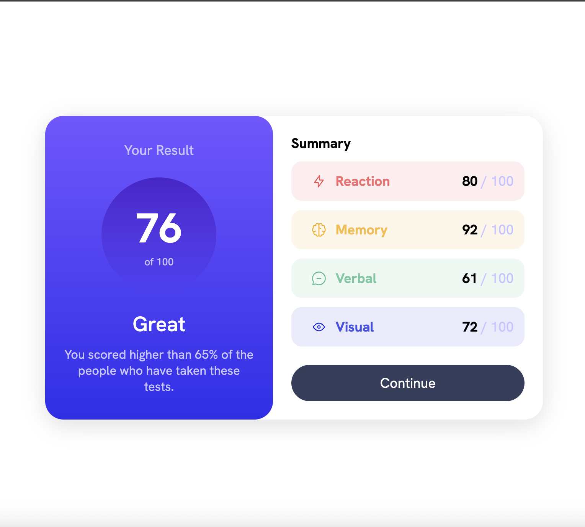

# Frontend Mentor - Results summary component solution

This is a solution to the [Results summary component challenge on Frontend Mentor](https://www.frontendmentor.io/challenges/results-summary-component-CE_K6s0maV). Frontend Mentor challenges help you improve your coding skills by building realistic projects.

## Table of contents

- [Frontend Mentor - Results summary component solution](#frontend-mentor---results-summary-component-solution)
  - [Table of contents](#table-of-contents)
  - [Overview](#overview)
    - [The challenge](#the-challenge)
    - [Screenshot](#screenshot)
    - [Links](#links)
  - [My process](#my-process)
    - [Built with](#built-with)
    - [What I learned](#what-i-learned)
    - [Continued development](#continued-development)
  - [Author](#author)
  - [Acknowledgments](#acknowledgments)

## Overview

### The challenge

Users should be able to:

- View the optimal layout for the interface depending on their device's screen size
- See hover and focus states for all interactive elements on the page

### Screenshot

### Links

- Solution URL: [Add solution URL here](https://github.com/RoosterRoo/results-summary)
- Live Site URL: [Add live site URL here](https://roosterroo.github.io/results-summary/)

## My process

### Built with

- Semantic HTML5 markup
- Flexbox
- Mobile-first workflow

### What I learned

Refresher on the descendent selector and combinator.

### Continued development

Will be working on using the existing JSON file to adhere to DRY principles. Will possibly convert this to a React based project in the future.

## Author

- Frontend Mentor - [@RoosterRoo](https://www.frontendmentor.io/profile/RoosterRoo)

## Acknowledgments

Thanks to Frontend Mentor for giving an opportunity to practice on real world UI components.
